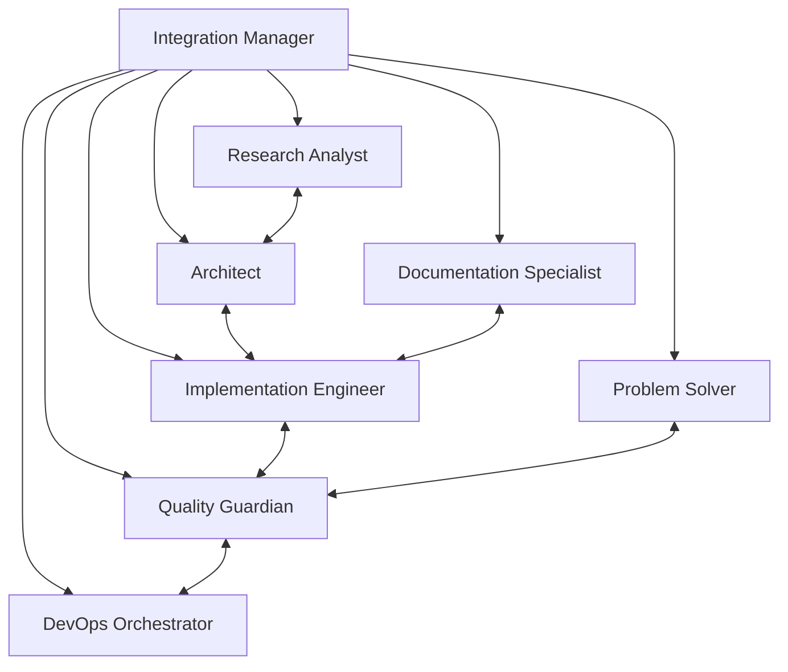

# CodeCognition Framework Guide

Comprehensive guide to leveraging the full power of CodeCognition's multi-agent architecture.

## 🏗️ Framework Architecture

### Core Components

```
CodeCognition Framework
├── 8 Specialized Agents (Independent 200K contexts)
├── Inter-Agent Communication System
├── Persistent Memory Management
├── Intelligent Hooks Automation
├── Workflow Orchestration Engine
└── Quality Gate Integration
```

### Agent Interaction Model



## 🤖 Agent Specializations

### 1. System Architect
**Expertise**: System design, architectural patterns, technology decisions
**Triggers**: Design analysis, integration planning, architectural reviews
**Outputs**: Design specifications, technology recommendations, architectural decisions

### 2. Implementation Engineer  
**Expertise**: Code development, feature implementation, refactoring
**Triggers**: Feature requests, bug fixes, code improvements
**Outputs**: Working code, tests, implementation documentation

### 3. Quality Guardian
**Expertise**: Security analysis, testing, code review, compliance
**Triggers**: Security concerns, quality validation, pre-deployment checks
**Outputs**: Security reports, test strategies, quality assessments

### 4. DevOps Orchestrator
**Expertise**: Infrastructure, deployment, monitoring, operations
**Triggers**: Deployment needs, performance issues, operational requirements
**Outputs**: Infrastructure code, deployment strategies, monitoring setups

### 5. Documentation Specialist
**Expertise**: Technical writing, API docs, user guides, knowledge management
**Triggers**: Documentation needs, knowledge gaps, user guidance requests
**Outputs**: Comprehensive documentation, guides, knowledge articles

### 6. Research Analyst
**Expertise**: Technology research, dependency analysis, impact assessment
**Triggers**: Technology evaluation, competitive analysis, research needs
**Outputs**: Research reports, technology comparisons, impact analyses

### 7. Problem Solver
**Expertise**: Debugging, troubleshooting, root cause analysis, issue resolution
**Triggers**: System issues, bugs, performance problems, incidents
**Outputs**: Root cause analyses, fixes, diagnostic reports, prevention strategies

### 8. Integration Manager
**Expertise**: Workflow orchestration, agent coordination, process optimization
**Triggers**: Complex multi-agent tasks, workflow optimization, emergency coordination
**Outputs**: Orchestrated workflows, coordination strategies, process improvements

## 🔄 Communication Patterns

### Message Types

| Type | Purpose | Priority | Response Required |
|------|---------|----------|-------------------|
| `context_share` | Share findings between agents | Medium | Optional |
| `coordination_request` | Request help from specific agent | High | Required |
| `decision_broadcast` | Announce critical decisions | High | Acknowledge |
| `status_update` | Report task completion | Low | None |
| `emergency_alert` | Critical issues requiring immediate attention | Critical | Required |

### Communication Flow

1. **Agent Initialization**: Each agent announces capabilities and availability
2. **Context Sharing**: Agents share relevant findings and insights
3. **Coordination Requests**: Agents request specific help from specialists
4. **Decision Broadcasting**: Major decisions are shared with relevant agents
5. **Status Updates**: Progress reports maintain workflow visibility

## 🧠 Memory Management

### Memory Types

#### Shared Knowledge Base
- Cross-agent insights and patterns
- Best practices learned through experience
- Common solutions to recurring problems
- Technology preferences and decisions

#### Agent-Specific Memory
- Specialized knowledge unique to each agent
- Learning history and capability evolution
- Success patterns for agent's domain
- Domain-specific lessons learned

#### Project Context
- Project-specific insights and constraints
- Team preferences and coding standards
- Historical decisions and outcomes
- Stakeholder requirements and feedback

#### Pattern Library
- Proven workflow templates
- Code patterns and implementations
- Problem-solution mappings
- Integration and collaboration patterns

### Memory Operations

#### Writing Memory
```json
{
  "memory_type": "shared_knowledge",
  "category": "performance_optimization",
  "key": "database_query_patterns",
  "content": {
    "pattern": "Use connection pooling with read replicas",
    "context": "E-commerce application with high read traffic",
    "results": "40% query time improvement, 60% throughput increase",
    "conditions": "PostgreSQL, >1000 concurrent users"
  },
  "confidence": 0.9,
  "source_agent": "problem-solver",
  "validation": "tested in production"
}
```

#### Memory Retrieval
- Automatic context loading based on task similarity
- Pattern matching for similar problems and solutions
- Historical success/failure analysis for decision making
- Cross-project knowledge application

## ⚙️ Workflow Orchestration

### Parallel Execution Patterns

#### Maximum Parallelism (10 agents)
```
Launch 10 parallel agents to explore different aspects:
- 3 agents for codebase analysis
- 2 agents for security assessment  
- 2 agents for performance evaluation
- 2 agents for integration analysis
- 1 agent for coordination
```

#### Sequential Refinement
```
Phase 1: Architect analyzes system design
Phase 2: Implementation Engineer codes solution
Phase 3: Quality Guardian validates implementation
Phase 4: DevOps Orchestrator prepares deployment
```

#### Hybrid Coordination
```
Parallel Discovery → Sequential Refinement → Parallel Validation
```

### Quality Gates

#### Automated Quality Gates
- Code quality metrics validation
- Security vulnerability scanning
- Performance threshold validation
- Documentation completeness checks
- Test coverage requirements

#### Agent-Driven Quality Gates
- Architectural consistency review (Architect)
- Implementation quality assessment (Quality Guardian)
- Operational readiness validation (DevOps Orchestrator)
- Documentation quality review (Documentation Specialist)

## 🔗 Integration Patterns

### IDE Integration
- Real-time agent coordination within development environment
- Context-aware agent suggestions based on current work
- Integrated quality gates within development workflow

### CI/CD Integration
- Automated agent execution within build pipelines
- Quality gate enforcement before deployment
- Continuous monitoring and optimization suggestions

### External Tool Integration
- Integration with project management tools
- Communication with monitoring and alerting systems
- Connection to documentation and knowledge management platforms

## 📊 Performance Optimization

### Token Management
- Smart context sharing to minimize token usage
- Efficient memory retrieval patterns
- Optimized agent selection for tasks

### Execution Optimization
- Intelligent task distribution based on agent workload
- Parallel execution optimization for maximum throughput
- Workflow caching and reuse patterns

### Resource Management
- Agent utilization monitoring and optimization
- Memory usage optimization for long-running sessions
- Communication overhead minimization

## 🔧 Customization and Extension

### Custom Agent Development
- Define specialized agents for domain-specific needs
- Extend existing agents with additional capabilities
- Create team-specific agent configurations

### Workflow Customization
- Design custom workflows for specific processes
- Modify existing workflows for team preferences
- Create project-specific orchestration patterns

### Hook System Extension
- Develop custom hooks for specific automation needs
- Integrate with external tools and systems
- Create quality gates tailored to project requirements

## 🎯 Best Practices

### Agent Coordination
- Use Integration Manager for complex multi-agent tasks
- Leverage parallel execution for independent analysis tasks
- Ensure proper communication protocols between agents

### Memory Management
- Regularly update shared knowledge with successful patterns
- Document lessons learned for future reference
- Maintain clean separation between project and general knowledge

### Quality Assurance
- Implement comprehensive quality gates at appropriate workflow points
- Use Quality Guardian for all security-sensitive operations
- Ensure documentation completeness for all major decisions

### Performance Optimization
- Monitor token usage and optimize for efficiency
- Use parallel execution judiciously based on task dependencies
- Implement caching strategies for frequently accessed information

---

*Master the CodeCognition framework to transform your development workflow with coordinated AI intelligence.*